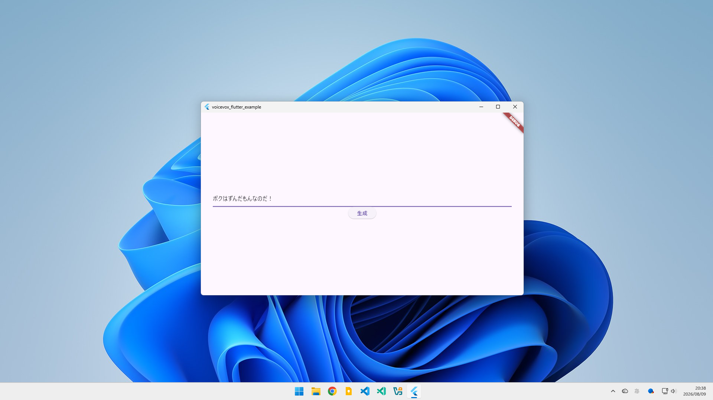
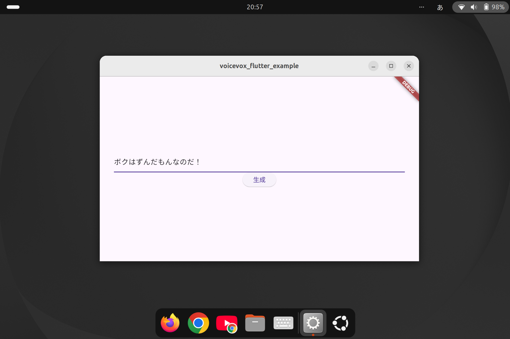

# voicevox_flutter  
[VOICEVOX CORE](https://github.com/VOICEVOX/voicevox_core) 0.16.3 の非公式ラッパーです。  
Android/Windows/Linuxに対応しています。

  

  

  

## 使い方
ご自身のFlutterアプリで使用するには、このリポジトリ全体を任意の場所に配置して、 `your_app/pubspec.yaml` を編集します。

```yaml
dependencies:
  voicevox_flutter:
    path: "C:/Users/kiritan/Downloads/voicevox_flutter"
```

動作にはVVM音声モデルとOpenJTalk辞書が必要です。実際の使用方法は[example](example)を参考にしてください。

## 高レベルAPI
[voicevox_flutter.dart](lib/voicevox_flutter.dart)を参照してください。

## 低レベルAPI
[generated_bindings.dart](lib/generated_bindings.dart)に[ffigen](https://github.com/dart-lang/ffigen)で生成しただけのものがあります。


## ライセンス
- voicevox_flutter: MITライセンスが適用されています。[LICENSE](LICENSE)を参照してください。  
  - lib/
  - example/lib/

- VOICEVOX CORE: MITライセンスが適用されています。[公式リポジトリ](https://github.com/VOICEVOX/voicevox_core/tree/main)を参照してください。
  - voicevox_core.h
  - android/src/main/jniLibs/arm64-v8a/libvoicevox_core.so
  - android/src/main/jniLibs/x86_64/libvoicevox_core.so
  - linux/blobs/x86_64/libvoicevox_core.so
  - windows/blobs/x86_64/voicevox_core.dll

- voicevox_onnxruntime: 独自の利用規約が適用されています。[公式リポジトリ](https://github.com/VOICEVOX/onnxruntime-builder/releases)を参照してください。
  - android/src/main/jniLibs/arm64-v8a/libvoicevox_onnxruntime.so
  - android/src/main/jniLibs/x86_64/libvoicevox_onnxruntime.so
  - linux/blobs/x86_64/libvoicevox_onnxruntime.so
  - linux/blobs/x86_64/libvoicevox_onnxruntime.so.1.17.3
  - windows/blobs/x86_64/voicevox_onnxruntime.lib

- VVM音声モデル: 独自の利用規約が適用されています。[公式リポジトリ](https://github.com/VOICEVOX/voicevox_vvm)を参照してください。
  - example/assets/model/0.vvm

- OpenJTalk辞書: 独自の利用規約が適用されています。[COPYING](example/assets/open_jtalk_dic_utf_8-1.11/COPYING)を参照してください。
  - example/assets/open_jtalk_dic_utf_8-1.11/

- Android NDK C++標準ライブラリ: Apache License 2.0が適用されています。[配布元ページ](https://developer.android.com/ndk/downloads?hl=ja)を参照してください。
  - android/src/main/jniLibs/arm64-v8a/libc++_shared.so
  - android/src/main/jniLibs/x86_64/libc++_shared.so

## VOICEVOX COREのバージョンアップ  
1. VOICEVOX COREの[Releases](https://github.com/VOICEVOX/voicevox_core/releases)から、ターゲットデバイスのOS/アーキテクチャに合ったC APIのファイルをダウンロードします。  
   - 例: voicevox_core-android-arm64-0.16.4.zip

2. 解凍すると動的ライブラリ (.so .dll) が入っているので、適切な場所に配置します。  
   - Android: voicevox_flutter/android/src/main/jniLibs/arm64-v8a/libvoicevox_core.so  
   - Windows: voicevox_flutter/windows/blobs/x86_64/voicevox_core.dll  
   - Linux: voicevox_flutter/linux/blobs/x86_64/libvoicevox_core.so

3. ヘッダーファイル `voicevox_core.h` も入っているので、voicevox_flutter/ 直下に配置します。

4. FFIバインディングコード `lib/generated_bindings.dart` を再生成します。手順を書ききることができなかったので、プロンプトを載せます。
   >Dart FFIが利用されている既存のパッケージのヘッダーファイルを変更したので、ffigenでバインディングコードを生成する手順を教えてください。開発環境はWindowsです。 

5. voicevox_onnxruntimeの[Releases](https://github.com/VOICEVOX/onnxruntime-builder/releases)から、ターゲットデバイスのOS/アーキテクチャに合った動的ライブラリをダウンロードします。
   - 例: voicevox_onnxruntime-android-arm64-1.17.3.tgz

6. 解凍すると動的ライブラリが入っているので、COREと同じ場所に配置します。

7. ビルドします。エラーが出ます。

9. 適宜直します。  
   - VOICEVOX側の機能追加や破壊的変更によって、Dartコードの変更が必要になることもあります。

---